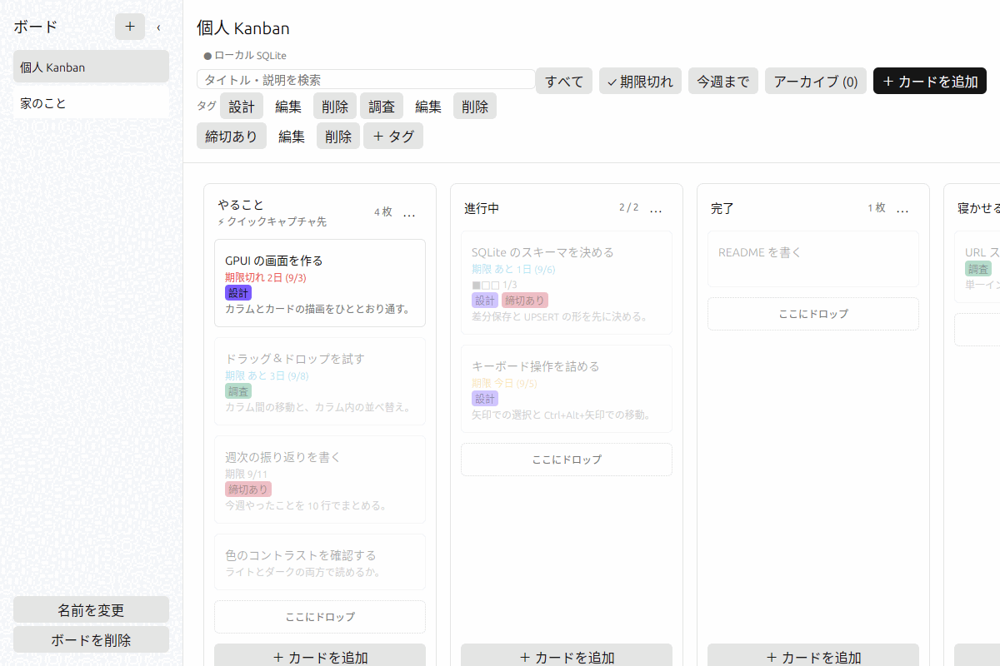

# ekanban マニュアル

ekanban の使い方をひととおり説明します。

- ekanban の紹介と入れ方は [README](../README.md) にあります
- 「なぜそう作ってあるか」は [設計の記録](DESIGN.md) にあります
- 手を入れる人向けの説明は [開発の手引き](DEVELOPMENT.md) にあります

この文書のスクリーンショットは Linux（X11）で撮ったものです。macOS ではウィンドウの枠とメニューバーの位置が違いますが、画面の中身は同じです。

---

## 1. ekanban とは

手元の SQLite ファイルだけで動く Kanban ボードです。アカウント、サーバー、ネットワーク接続を必要としません。

やらないことも決めてあります。クラウド同期、共有、通知、Markdown の描画、他ツールからのインポートは実装しません。理由は [設計の記録](DESIGN.md) にあります。

---

## 2. 起動とデータの置き場所

`make run` で起動します。macOS では `make open` で `.app` を作って起動すると、Dock のアイコンとアプリ名が正しく出ます。

データベースは OS ごとの標準の場所に作られます。

| OS | 置き場所 |
| --- | --- |
| macOS | `~/Library/Application Support/ekanban/ekanban.sqlite3` |
| Linux/BSD | `$XDG_DATA_HOME/ekanban/` または `~/.local/share/ekanban/` |
| Windows | `%APPDATA%\ekanban\` |

`EKANBAN_DATABASE` に絶対パスを渡すと、そのファイルを使います。別のデータで試したいときに便利です。

```sh
EKANBAN_DATABASE=/tmp/試し.sqlite3 make run
```

場所を忘れたときは、ヘルプメニューの「データベースの場所をFinderで開く」で開けます。

---

## 3. ボードの見方


- **左** がボード一覧です。`‹` で細い帯に畳めます
- **中央上** がヘッダです。ボード名、保存の状態、検索、絞り込みが並びます
- **中央** がカラムとカードです。横に並び、はみ出す分は横スクロールします

### カラムのヘッダ

- 右端の数字はカードの枚数です。WIP 上限を決めているカラムでは `2 / 2` のように出ます。**上限を超えると赤くなります**
- `…` がカラムのメニューです（後述）
- キャプチャ先に指定したカラムには「⚡ クイックキャプチャ先」と出ます

### カード

カードには、タイトル、期限、チェックリストの進み具合、タグ、説明の先頭が出ます。

**カードのタグは押せます。** 押すとそのタグで絞り込みます（後述）。

期限は残り日数で書き分けます。**色だけで区別させない**方針なので、文言でも分かるようにしてあります。

| 表示 | 意味 |
| --- | --- |
| `期限切れ 2日 (9/3)` | 過ぎている |
| `期限 今日 (9/5)` | 今日まで |
| `期限 あと 3日 (9/8)` | 近い |
| `期限 9/11` | それより先 |

### カラムの `…` メニュー

| 項目 | 内容 |
| --- | --- |
| 期限順 | そのカラムのカードを期限の早い順に並べ替える。期限の無いカードは後ろにまとめる |
| アーカイブ | そのカラムのカードをまとめてアーカイブする（確認あり） |
| クイックキャプチャ先にする | 後述のクイックキャプチャの入れ先にする |
| 編集 | カラム名と WIP 上限を変える |
| 削除 | カラムごと消す（確認あり）。最後の 1 つは消せない |

---

## 4. カードを足す・編集する

- カラムの下にある「+ カードを追加」で、そのカラムに足します
- ヘッダ右の「+ カードを追加」または `Cmd+N` / `Ctrl+N` でも足せます
- カードをダブルクリック、または選んで `Enter` で編集を開きます

編集は**右側のパネル**で開きます。編集できるのは次の項目です。

- タイトル
- 説明（プレーンテキストです。Markdown は描画しません）
- 期限（`YYYY-MM-DD`。**日付だけで、時刻は持ちません**）
- タグの付け外し
- チェックリスト（項目の追加、チェック、削除）

保存は「保存」ボタンか `Cmd+S` / `Ctrl+S`、取り消しは `Escape` です。

### カードの右クリックメニュー

常用しない操作は画面に出さず、右クリックにまとめてあります。

| 項目 | 内容 |
| --- | --- |
| コピー | 同じ内容のカードを作る |
| タグ名 | タグを直接付け外しする |
| アーカイブ | ボードから外して、アーカイブ表示に移す |
| 削除 | 消す（確認あり） |

---

## 5. 動かす

### ドラッグ＆ドロップ

- カードは**カラム間の移動**と**カラム内の並べ替え**ができます
- カラム自体もドラッグして並べ替えられます
- 端に近づけると自動でスクロールします
- 空のカラムには「ここにドロップ」が出ます

並べ替えは見た目だけの変更ではなく、そのまま保存されます。

### キーボード

| 操作 | キー |
| --- | --- |
| カードを選ぶ | 矢印キー |
| 選んだカードを編集 | `Enter` |
| 選んだカードを削除 | `Delete` / `Backspace` |
| 選んだカードを移動 | `Cmd+Option+矢印` / `Ctrl+Alt+矢印` |

入力欄や検索欄にフォーカスがある間、ボードのショートカットは効きません。日本語入力の変換を邪魔しないためです。

### 元に戻す

`Cmd+Z` / `Ctrl+Z` で戻せます。やり直しは `Cmd+Shift+Z` / `Ctrl+Shift+Z` です。

戻せるのは、そのセッションで開いているボードに対する操作です。アプリを終了すると履歴は消えます。

---

## 6. 絞り込む

絞り込みは**カードを隠さず、暗くします**。隠してしまうとドラッグの落とし先が変わってしまうためです。

### 検索

`Cmd+F` / `Ctrl+F` で検索欄に移ります。タイトルと説明を探します。全角と半角、大文字と小文字は同じものとして扱います。


`Escape` または「クリア」で解除します。

### 期限

ヘッダ右のボタンで切り替えます。`Cmd+0` `Cmd+1` `Cmd+2`（macOS 以外は `Ctrl`）でも切り替えられます。



### タグ

**カードに付いているタグを押す**と、そのタグの付いたカードだけが明るくなります。絞り込み中のタグには `✓` が付き、ヘッダに「タグで絞り込み中」と出ます。


解除は、同じタグをもう一度押すか、ヘッダの「クリア」です。

タグそのものの追加・編集・削除は、メニューの **ボード > タグを整理…** で開くパネルで行います。`Cmd+Shift+T` / `Ctrl+Shift+T` は、このパネルを開いてタグの追加を始めます。色は自由に決められます。

ヘッダにタグを並べていたのはやめました。タグが増えるほどヘッダが混み、絞り込みたいタグはたいてい目の前のカードに付いているためです。

---

## 7. アーカイブ

終わったカードは削除せずアーカイブできます。カードの右クリックメニュー、またはカラムの `…` メニューの「アーカイブ」（そのカラムのカードをまとめて）から行います。

ヘッダの「アーカイブ (件数)」または `Cmd+Shift+A` / `Ctrl+Shift+A` でアーカイブ表示に切り替わります。ここから元のカラムに戻せます。

---

## 8. 複数のボード

左のボード一覧で切り替えます。追加は `+`、名前の変更と削除は一覧の下のボタンです。

最後に開いていたボードは覚えていて、次の起動でそれが開きます。


`‹` を押すと細い帯になり、ボードの幅が広がります。`Super+Ctrl+S`（macOS では `Cmd+Ctrl+S`）でも切り替えられます。

---

## 9. クイックキャプチャ

思いついたことを、ボードを開かずに 1 行だけ書き留める仕組みです。

対応しているのは **macOS と、X11 セッションの Linux / BSD** です。Wayland にはアプリから使えるグローバルホットキーの共通の仕組みが無いため使えません。使えない環境ではメニューの項目が灰色になり、理由が文言に出ます。

### 1. ショートカットを割り当てる

ekanban メニューの「クイックキャプチャのショートカット…」を選び、割り当てたい組み合わせをそのまま押します。

- **既定では無効です。** 自分で割り当てるまで、ホットキーは 1 つも登録しません。グローバルホットキーは全画面でその組み合わせを奪うので、断りなく取りません
- 修飾キーを 1 つ以上含める必要があります
- ほかのアプリが既に押さえている組み合わせは登録できません。その場で理由が出て、以前の割り当てが残ります
- 「解除する」で無効に戻ります
- 常駐はしないので、効くのは ekanban が起動している間だけです

### 2. 入れ先を決める

カラムの `…` メニューの「クイックキャプチャ先にする」で決めます。設定画面はありません。

- 既定は、最後に開いていたボードの先頭カラムです
- 入れ先のカラムには「⚡ クイックキャプチャ先」と出ます
- 入れ先はアプリ全体で 1 つです。**ボードを切り替えても変わりません**
- 別のボードのカラムを指している場合、そのボードを開いていなくてもそこに入ります（その場合だけ、そのカードは Undo の対象になりません）
- 入れ先のボードやカラムを削除したときは、黙って既定に戻ります

### 3. 使う

ホットキーを押すと、1 行入力だけの小さいウィンドウが画面中央に出ます。

- 入力欄にフォーカスがある状態で開き、上に入れ先（「ボード名 / カラム名」）が出ます
- `Enter` で入れ先のカラムの末尾にカードが増え、ウィンドウが閉じます。`Escape` は捨てて閉じます
- どちらもフォーカスは直前のアプリに戻ります
- 入力できるのはタイトルだけです。期限やタグを付けたくなったらボードを開いてください
- 保存に失敗したときは閉じず、入力を残したままエラーを出します

---

## 10. テーマ

表示メニューの「ライトモード」「ダークモード」「システムに合わせる」で切り替えます。選んだ設定は覚えています。


---

## 11. 書き出しとバックアップ

| やりたいこと | 場所 |
| --- | --- |
| JSON で書き出す | ファイルメニュー「ボードを書き出す（JSON）」 |
| Markdown で書き出す | ファイルメニュー「ボードを書き出す（Markdown）」 |
| データベースを丸ごと控える | ヘルプメニュー「データベースをコピー…」 |
| データベースの場所を開く | ヘルプメニュー「データベースの場所をFinderで開く」 |

バックアップは SQLite の `VACUUM INTO` で作るので、アプリを止めなくても壊れた控えにはなりません。

---

## 12. キーボードショートカット

macOS の `Cmd` は、ほかの OS では `Ctrl` になります。例外は `Cmd+Ctrl+S` のように `Ctrl` を含む組み合わせで、こちらは `Super+Ctrl` のままです。

| 操作 | macOS | その他の OS |
| --- | --- | --- |
| カードを追加 | `Cmd+N` | `Ctrl+N` |
| カラムを追加 | `Cmd+Shift+N` | `Ctrl+Shift+N` |
| ボードを追加 | `Cmd+Shift+B` | `Ctrl+Shift+B` |
| タグを追加（タグ整理パネルを開く） | `Cmd+Shift+T` | `Ctrl+Shift+T` |
| 保存 | `Cmd+S` | `Ctrl+S` |
| 検索にフォーカス | `Cmd+F` | `Ctrl+F` |
| 検索をクリア | `Cmd+Shift+F` | `Ctrl+Shift+F` |
| すべてのカード | `Cmd+0` | `Ctrl+0` |
| 期限切れのカード | `Cmd+1` | `Ctrl+1` |
| 今週までのカード | `Cmd+2` | `Ctrl+2` |
| アーカイブ表示 | `Cmd+Shift+A` | `Ctrl+Shift+A` |
| 元に戻す / やり直す | `Cmd+Z` / `Cmd+Shift+Z` | `Ctrl+Z` / `Ctrl+Shift+Z` |
| ボード一覧の表示を切り替え | `Cmd+Ctrl+S` | `Super+Ctrl+S` |
| フルスクリーン | `Cmd+Ctrl+F` | `Super+Ctrl+F` |
| ウインドウを閉じる | `Cmd+W` | `Ctrl+W` |
| カードを選ぶ | 矢印キー | 矢印キー |
| 選んだカードを編集 | `Enter` | `Enter` |
| 選んだカードを削除 | `Delete` | `Delete` |
| 選んだカードを移動 | `Cmd+Option+矢印` | `Ctrl+Alt+矢印` |

---

## 13. 困ったとき

### 「保存に失敗しました」と出た

保存は非同期です。失敗したときは、その操作の**前の状態に戻して**から知らせます。画面に出ている内容とデータベースの中身が食い違ったままにはなりません。

よくある原因は、ほかのプロセスがデータベースを掴んでいること（「データベースが使用中です」）と、保存先の権限（「データベースに書き込めません」）です。

### 起動しない

起動時の失敗とパニックはログに残ります。

| OS | 置き場所 |
| --- | --- |
| macOS | `~/Library/Logs/ekanban.log` |
| Linux/BSD | `$XDG_STATE_HOME/ekanban/` または `~/.local/state/ekanban/` |
| Windows | `%LOCALAPPDATA%\ekanban\` |

起動できないときはダイアログでも知らせます。ダイアログの表示には macOS では `osascript`、Windows では PowerShell、Linux/BSD では `zenity` / `kdialog` / `xmessage` のうち最初に見つかったものを使います。どれも無い環境ではログだけが残ります。

### ショートカットが効かない

入力欄や検索欄にフォーカスがあると、ボードのショートカットは無効になります。`Escape` で編集を抜けてから押してください。
