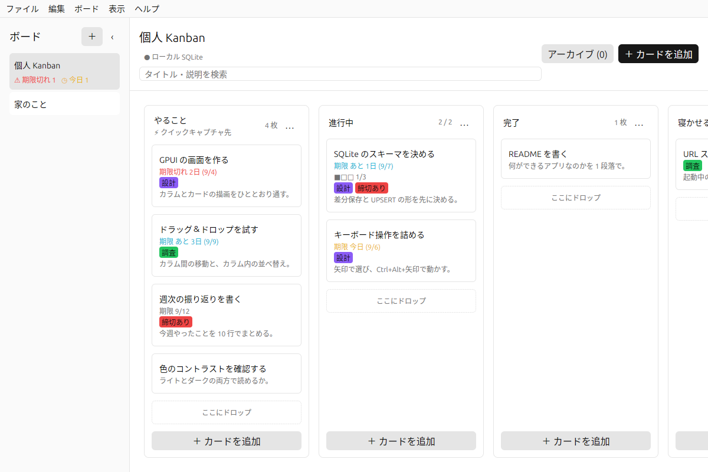
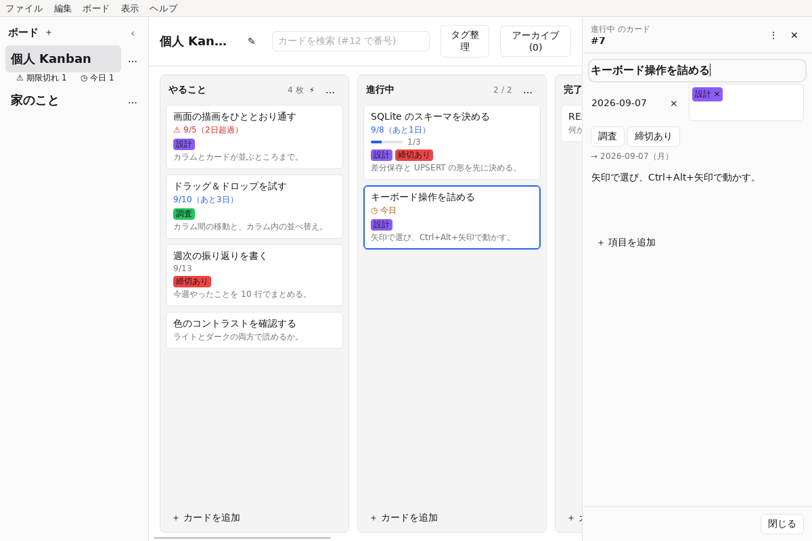
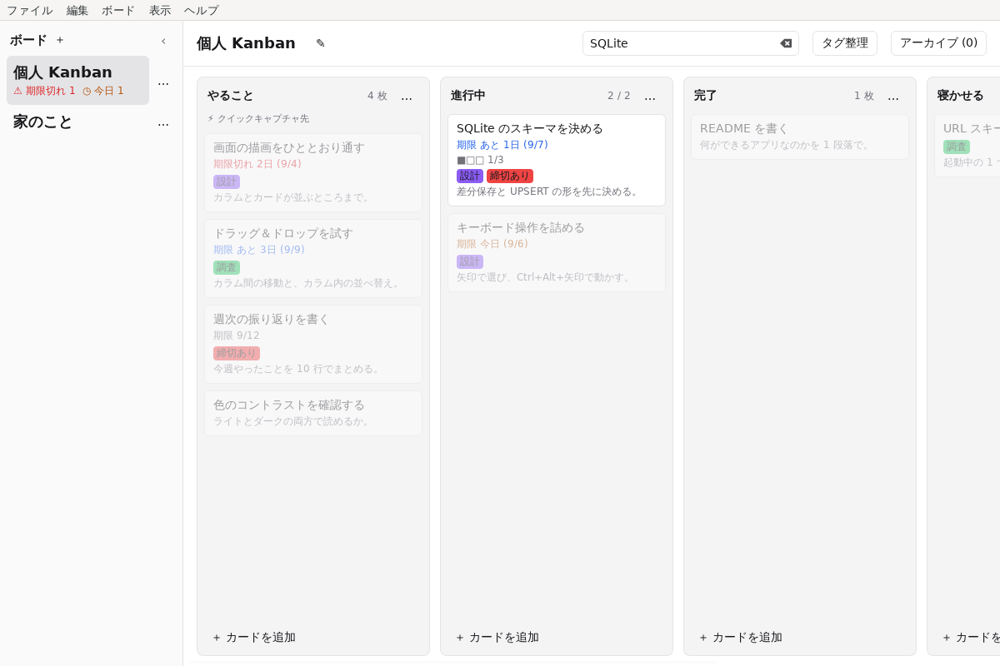
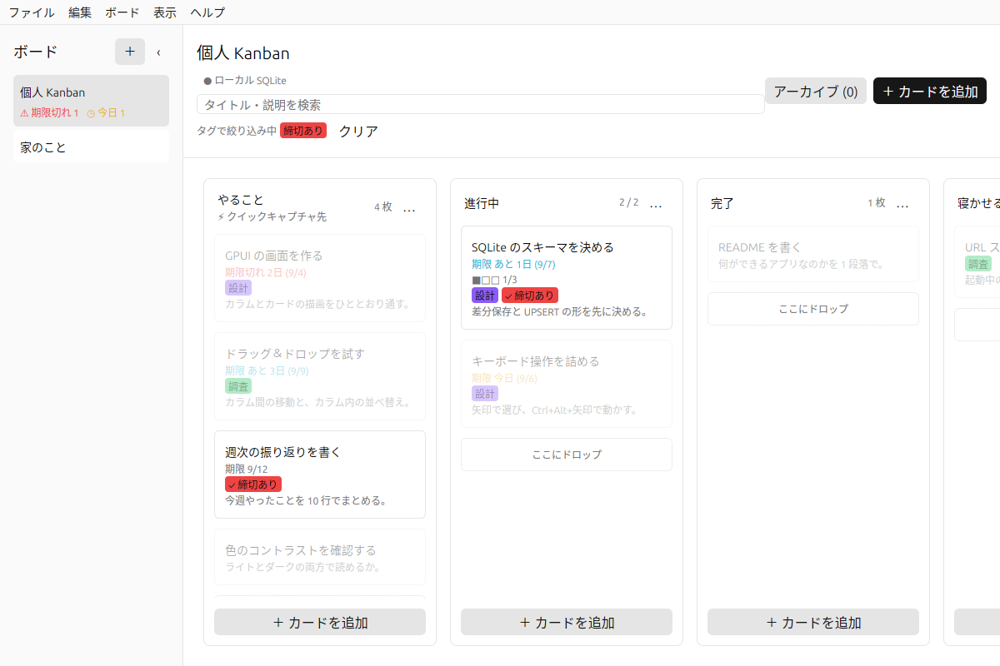
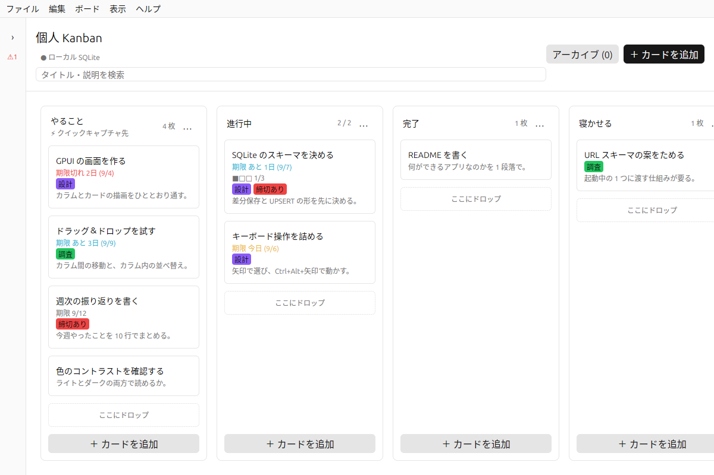
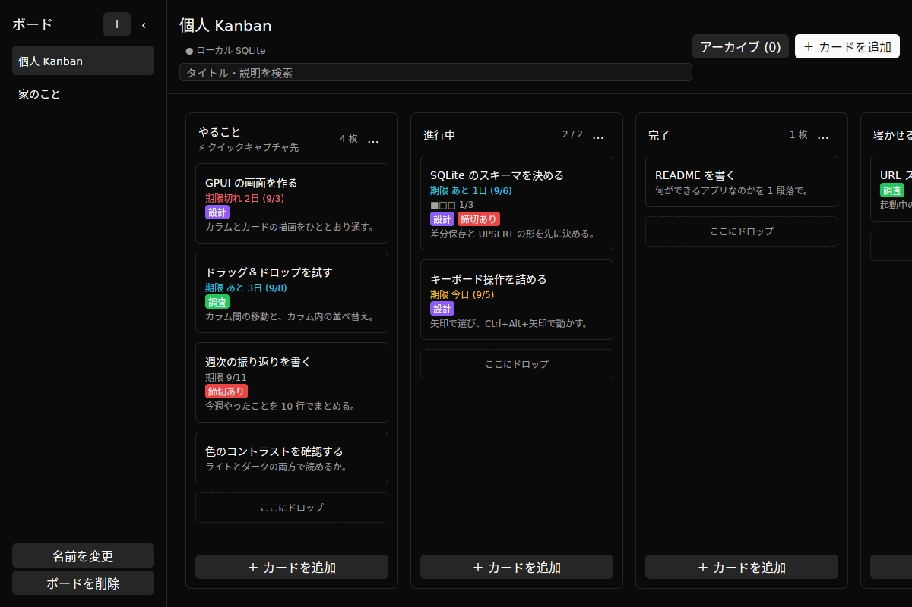

# ekanban マニュアル

ekanban の使い方をひととおり説明します。

- ekanban の紹介と入れ方は [README](../README.md) にあります
- 「なぜそう作ってあるか」は [設計の記録](DESIGN.md) にあります
- 手を入れる人向けの説明は [開発の手引き](DEVELOPMENT.md) にあります

この文書のスクリーンショットは Linux（X11）で撮ったものです。macOS ではウィンドウの枠が違い、メニューが画面上端のメニューバーに出ます。そのぶん macOS ではヘッダの `≡` が出ません（「[メニュー](#4-メニュー)」を参照）。ほかの中身は同じです。

---

## 1. ekanban とは

手元の SQLite ファイルだけで動く Kanban ボードです。アカウント、サーバー、ネットワーク接続を必要としません。

やらないことも決めてあります。クラウド同期、共有、通知、Markdown の描画、他ツールからのインポートは実装しません。理由は [設計の記録](DESIGN.md) にあります。

---

## 2. 起動とデータの置き場所

`make run` で起動します。macOS では `make open` で `.app` を作って起動すると、Dock のアイコンとアプリ名が正しく出ます。

データベースは OS ごとの標準の場所に作られます。

| OS | 置き場所 |
| --- | --- |
| macOS | `~/Library/Application Support/ekanban/ekanban.sqlite3` |
| Linux/BSD | `$XDG_DATA_HOME/ekanban/` または `~/.local/share/ekanban/` |
| Windows | `%APPDATA%\ekanban\` |

`EKANBAN_DATABASE` に絶対パスを渡すと、そのファイルを使います。別のデータで試したいときに便利です。

```sh
EKANBAN_DATABASE=/tmp/試し.sqlite3 make run
```

場所を忘れたときは、メニューの「データベースの場所を開く」で開けます（macOS では「データベースの場所をFinderで開く」）。

### 同時に起動できるのは 1 つだけ

**同じデータベースに対しては、ekanban は 1 つしか起動しません。** すでに動いているときに 2 つ目を起動すると、その旨が出て終了します。開いているウィンドウを使ってください。

2 つのプロセスが同じファイルを開くと、それぞれが自分の盤面をメモリに持ち、**あとから保存したほうが、もう片方で足したカードを消します**。どちらの画面も自分の状態を出し続けるので、消えたことにも気づけません。それを起こさないための制限です。

`EKANBAN_DATABASE` で別のファイルを指定したときは、別のものとして同時に起動できます。

---

## 3. ボードの見方

初めて起動すると、**「やること / 進行中 / 完了」の 3 つの空のカラム**だけがあるボードが作られます。カードは入っていないので、消して回る必要はありません。そのまま自分のボードとして使い始められます。




- **左** がボード一覧です。`‹` で細い帯に畳めます
- **中央上** がヘッダです。ボード名、保存の状態、検索、アーカイブ、カードの追加、`≡` メニューが並びます
- **中央** がカラムとカードです。横に並び、はみ出す分は横スクロールします

### カラムのヘッダ

- 右端の数字はカードの枚数です。WIP 上限を決めているカラムでは `2 / 2` のように出ます。**上限を超えると赤くなります**
- `…` がカラムのメニューです（後述）
- キャプチャ先に指定したカラムには「⚡ クイックキャプチャ先」と出ます

### カード

カードには、タイトル、期限、チェックリストの進み具合、タグ、説明の先頭が出ます。

説明に `https://` で始まるアドレスを書いておくと、**カードを開いたときに説明欄の下に「リンク」として並びます**。押すと既定のブラウザで開きます。説明そのものはプレーンテキストのままで、Markdown は解釈しません。

**カードのタグは押せます。** 押すとそのタグで絞り込みます（後述）。

期限は残り日数で書き分けます。**色だけで区別させない**方針なので、文言でも分かるようにしてあります。

| 表示 | 意味 |
| --- | --- |
| `期限切れ 2日 (9/3)` | 過ぎている |
| `期限 今日 (9/5)` | 今日まで |
| `期限 あと 3日 (9/8)` | 近い |
| `期限 9/11` | それより先 |

### カラムの `…` メニュー

| 項目 | 内容 |
| --- | --- |
| 期限順 | そのカラムのカードを期限の早い順に並べ替える。期限の無いカードは後ろにまとめる |
| アーカイブ | そのカラムのカードをまとめてアーカイブする（確認あり） |
| クイックキャプチャ先にする | 後述のクイックキャプチャの入れ先にする |
| 編集 | カラム名と WIP 上限を変える |
| 削除 | カラムごと消す（確認あり）。最後の 1 つは消せない |

---

## 4. メニュー

ボードの追加や削除、書き出し、テーマの切り替えのように**毎回は使わない操作**は、画面に並べずメニューに畳んであります。メニューの出方は OS で違います。

| OS | 場所 |
| --- | --- |
| macOS | 画面上端のメニューバー |
| Linux / Windows | ヘッダ右端の `≡` |

Linux と Windows にはアプリのメニューバーが無いので、同じ項目をヘッダの `≡` から出します。開いたメニューは `Escape` か、もう一度 `≡` を押すと閉じます。

「ウインドウ」メニューの「しまう」「拡大／縮小」は macOS だけです。ほかの OS では最小化も最大化もウィンドウマネージャの仕事なので、`≡` には出しません。

### Wayland のとき（GNOME など）

Wayland のコンポジタには、ウィンドウの枠をアプリ側に描かせるものがあります（GNOME がそうです）。その場合、ekanban は**自分でタイトルバーを出します**。掴んで動かし、右端のボタンで「しまう / 拡大 / 閉じる」ができ、ウィンドウの縁でリサイズできます。

X11 と macOS では枠をウィンドウマネージャが描くので、このタイトルバーは出ません。

**Wayland では、ウィンドウの位置は復元されません。** 大きさだけが戻ります。Wayland ではアプリが自分の画面上の位置を知ることも指定することもできない決まりなので、これはアプリ側では直せません。クイックキャプチャの小窓が画面中央に出ないのも同じ理由です。

### macOS でウィンドウを閉じたとき

macOS では `Cmd+W` でウィンドウを閉じても ekanban は終了しません。メニューバーだけが残ります。**Dock のアイコンを押すと、ボードのウィンドウが戻ります。** 閉じている間に[クイックキャプチャ](#10-クイックキャプチャ)で足したカードも入った状態で開きます。

Linux と Windows では、最後のウィンドウを閉じるとアプリも終わります。

この文書で「ファイルメニュー」「ヘルプメニュー」のように書いてあるものは、`≡` では「データ」の見出しの下にあります。

---

## 5. カードを足す・編集する

- カラムの下にある「+ カードを追加」で、そのカラムに足します
- ヘッダ右の「+ カードを追加」または `Cmd+N` / `Ctrl+N` でも足せます
- カードを押す、または選んで `Enter` で編集を開きます

「+ カードを追加」を押すと、**空のカードの編集パネルが開きます**。タイトルを入れて保存すると、そのカラムの末尾に増えます。

**保存するまで、カードはまだ足されていません。** タイトルを入れずに「キャンセル」や `Escape` で閉じれば、何も残りません。入力し終わるまでの間は、ボードの上に「（タイトル未入力）」と出ます。

編集は**右側のパネル**で開きます。



パネルの上には、そのカードが今どのカラムにあるかと番号が出ます。`⋮` はコピー・アーカイブ・削除、`✕` は閉じるです。

編集できるのは次の項目です。

- タイトル（**これだけが必須**です。空のままでは保存できません）
- 説明（任意。プレーンテキストです。Markdown は描画しません）
- 期限（`YYYY-MM-DD`。**日付だけで、時刻は持ちません**）。「今日」「明日」「今週末」「来週」で埋められ、「クリア」で期限なしに戻ります
- タグの付け外し。付いているタグには `✓` が付きます
- チェックリスト（項目の追加、チェック、`↑` `↓` での並べ替え、削除）

保存は「保存」ボタンか `Cmd+S` / `Ctrl+S`、取り消しは「キャンセル」か `Escape` です。**タイトル欄で `Enter` を押しても保存します。** 説明欄の `Enter` は改行なので、保存にはなりません。

編集したまま別のカードを押したときは、黙って捨てずに先に保存します。タイトルが空だったり期限の書式が違ったりして保存できないときは、切り替わらずその場に留まります。

### カードの右クリックメニュー

常用しない操作は画面に出さず、右クリックにまとめてあります。

| 項目 | 内容 |
| --- | --- |
| コピー | 同じ内容のカードを作る |
| タグ名 | タグを直接付け外しする |
| アーカイブ | ボードから外して、アーカイブ表示に移す |
| 削除 | 消す（確認あり） |

---

## 6. 動かす

### ドラッグ＆ドロップ

- カードは**カラム間の移動**と**カラム内の並べ替え**ができます
- カラム自体もドラッグして並べ替えられます
- 端に近づけると自動でスクロールします
- 空のカラムには「ここにドロップ」が出ます

並べ替えは見た目だけの変更ではなく、そのまま保存されます。

### キーボード

| 操作 | キー |
| --- | --- |
| カードを選ぶ | 矢印キー |
| 選んだカードを編集 | `Enter` |
| タイトルを入れたカードを保存 | `Enter`（タイトル欄で） |
| 選んだカードを削除 | `Delete` / `Backspace` |
| 選んだカードを移動 | `Cmd+Option+矢印` / `Ctrl+Alt+矢印` |

入力欄や検索欄にフォーカスがある間、ボードのショートカットは効きません。日本語入力の変換を邪魔しないためです。

### 元に戻す

`Cmd+Z` / `Ctrl+Z` で戻せます。やり直しは `Cmd+Shift+Z` / `Ctrl+Shift+Z` です。

戻せるのは、そのセッションで開いているボードに対する操作です。アプリを終了すると履歴は消えます。

---

## 7. 絞り込む

絞り込みは**カードを隠さず、暗くします**。隠してしまうとドラッグの落とし先が変わってしまうためです。絞り込めるのは検索とタグの 2 つです。期限での絞り込みは、使い道が無かったので外しました。

### 検索

`Cmd+F` / `Ctrl+F` で検索欄に移ります。タイトルと説明を探します。全角と半角、大文字と小文字は同じものとして扱います。



`Escape` または「クリア」で解除します。

### タグ

**カードに付いているタグを押す**と、そのタグの付いたカードだけが明るくなります。絞り込み中のタグには `✓` が付き、ヘッダに「タグで絞り込み中」と出ます。



解除は、同じタグをもう一度押すか、ヘッダの「クリア」です。

タグそのものの追加・編集・削除は、メニューの **ボード > タグを整理…** で開くパネルで行います。`Cmd+Shift+T` / `Ctrl+Shift+T` は、このパネルを開いてタグの追加を始めます。色は自由に決められます。

ヘッダにタグを並べていたのはやめました。タグが増えるほどヘッダが混み、絞り込みたいタグはたいてい目の前のカードに付いているためです。

---

## 8. アーカイブ

終わったカードは削除せずアーカイブできます。カードの右クリックメニュー、またはカラムの `…` メニューの「アーカイブ」（そのカラムのカードをまとめて）から行います。

ヘッダの「アーカイブ (件数)」または `Cmd+Shift+A` / `Ctrl+Shift+A` でアーカイブ表示に切り替わります。ここから元のカラムに戻せます。

---

## 9. 複数のボード

左のボード一覧で切り替えます。追加は `+` です。名前の変更と削除は毎回使うものではないので、メニューの「ボード」にあります（macOS はメニューバーの「ボード」、ほかの OS はヘッダの `≡`）。

ボードが 1 つしかないときは削除できません。「最後のボードは削除できません」と出ます。

最後に開いていたボードは覚えていて、次の起動でそれが開きます。



`‹` を押すと細い帯になり、ボードの幅が広がります。`Super+Ctrl+S`（macOS では `Cmd+Ctrl+S`）でも切り替えられます。

---

## 10. クイックキャプチャ

思いついたことを、ボードを開かずに 1 行だけ書き留める仕組みです。

対応しているのは **macOS と、X11 セッションの Linux / BSD** です。Wayland にはアプリから使えるグローバルホットキーの共通の仕組みが無いため使えません。使えない環境ではメニューの項目が灰色になり、理由が文言に出ます。

### 1. ショートカットを割り当てる

メニューの「クイックキャプチャのショートカット…」（macOS では ekanban メニュー、ほかの OS は `≡` の「その他」）を選び、割り当てたい組み合わせをそのまま押します。

- **既定では無効です。** 自分で割り当てるまで、ホットキーは 1 つも登録しません。グローバルホットキーは全画面でその組み合わせを奪うので、断りなく取りません
- 修飾キーを 1 つ以上含める必要があります
- ほかのアプリが既に押さえている組み合わせは登録できません。その場で理由が出て、以前の割り当てが残ります
- 「解除する」で無効に戻ります
- 常駐はしないので、効くのは ekanban が起動している間だけです

### 2. 入れ先を決める

カラムの `…` メニューの「クイックキャプチャ先にする」で決めます。設定画面はありません。

- 既定は、最後に開いていたボードの先頭カラムです
- 入れ先のカラムには「⚡ クイックキャプチャ先」と出ます
- 入れ先はアプリ全体で 1 つです。**ボードを切り替えても変わりません**
- 別のボードのカラムを指している場合、そのボードを開いていなくてもそこに入ります（その場合だけ、そのカードは Undo の対象になりません）
- 入れ先のボードやカラムを削除したときは、黙って既定に戻ります

### 3. 使う

ホットキーを押すと、1 行入力だけの小さいウィンドウが画面中央に出ます。

- 入力欄にフォーカスがある状態で開き、上に入れ先（「ボード名 / カラム名」）が出ます
- `Enter` で入れ先のカラムの末尾にカードが増え、ウィンドウが閉じます。`Escape` は捨てて閉じます
- どちらもフォーカスは直前のアプリに戻ります
- 入力できるのはタイトルだけです。期限やタグを付けたくなったらボードを開いてください
- 保存に失敗したときは閉じず、入力を残したままエラーを出します

---

## 11. テーマ

メニューの「表示」にある「ライトモード」「ダークモード」「システムに合わせる」で切り替えます。選んだ設定は覚えています。



---

## 12. 書き出しとバックアップ

| やりたいこと | 場所 |
| --- | --- |
| JSON で書き出す | ファイルメニュー「ボードを書き出す（JSON）」 |
| Markdown で書き出す | ファイルメニュー「ボードを書き出す（Markdown）」 |
| データベースを丸ごと控える | ヘルプメニュー「データベースをコピー…」 |
| データベースの場所を開く | ヘルプメニュー「データベースの場所をFinderで開く」 |
| 自動バックアップの場所を開く | ヘルプメニュー「バックアップの場所をFinderで開く」 |

メニューバーの無い OS では、どれもヘッダの `≡` の「データ」にあります。

バックアップは SQLite の `VACUUM INTO` で作るので、アプリを止めなくても壊れた控えにはなりません。

### 自動バックアップ

**起動するたびに、その日ぶんの控えが 1 つ自動で作られます。** 置き場所はデータベースの隣の `backups/` です。

| OS | 置き場所 |
| --- | --- |
| macOS | `~/Library/Application Support/ekanban/backups/` |
| Linux/BSD | `$XDG_DATA_HOME/ekanban/backups/` または `~/.local/share/ekanban/backups/` |
| Windows | `%APPDATA%\ekanban\backups\` |

ファイル名は `ekanban-2026-09-05.sqlite3` のように日付が入ります。残るのは**新しいほうから 7 世代**で、古いものは自動で消えます。

刻みが「起動ごと」ではなく「1 日ごと」なのは意図的です。起動ごとに取ると、うっかりカラムを消したあとに何度か起動し直しただけで、無事だった控えが押し出されて消えてしまいます。日付で刻んでおけば、同じ日に何度起動しても残るのはその日の最初の 1 回、つまり**まだ壊していない状態**です。

控えを取るのに失敗しても起動は止まりません。理由は[ログ](#14-困ったとき)に残ります。

### 控えから戻す

アプリの中から戻す機能はありません。ファイルを差し替えます。

1. ekanban を終了する
2. 「バックアップの場所をFinderで開く」で `backups/` を開き、戻したい日付のファイルを選ぶ
3. それを 1 つ上のディレクトリの `ekanban.sqlite3` に上書きコピーする（今のファイルを別名で取っておくと、戻しすぎたときに引き返せます）
4. ekanban を起動する

中身を先に確かめたいときは、上書きせずにそのファイルを直接開けます。

```sh
EKANBAN_DATABASE=~/Library/Application\ Support/ekanban/backups/ekanban-2026-09-05.sqlite3 make run
```

**この控えはデータベースと同じディスクにあります。** アプリの不具合や操作のうっかりからは守れますが、ディスクが壊れたり、ディレクトリごと消したりした場合には一緒に失われます。それが心配なら、`backups/` をふだん使っているバックアップの対象に含めてください。

---

## 13. キーボードショートカット

macOS の `Cmd` は、ほかの OS では `Ctrl` になります。例外は `Cmd+Ctrl+S` のように `Ctrl` を含む組み合わせで、こちらは `Super+Ctrl` のままです。

| 操作 | macOS | その他の OS |
| --- | --- | --- |
| カードを追加 | `Cmd+N` | `Ctrl+N` |
| カラムを追加 | `Cmd+Shift+N` | `Ctrl+Shift+N` |
| ボードを追加 | `Cmd+Shift+B` | `Ctrl+Shift+B` |
| タグを追加（タグ整理パネルを開く） | `Cmd+Shift+T` | `Ctrl+Shift+T` |
| 保存 | `Cmd+S` | `Ctrl+S` |
| 検索にフォーカス | `Cmd+F` | `Ctrl+F` |
| 検索をクリア | `Cmd+Shift+F` | `Ctrl+Shift+F` |
| アーカイブ表示 | `Cmd+Shift+A` | `Ctrl+Shift+A` |
| 元に戻す / やり直す | `Cmd+Z` / `Cmd+Shift+Z` | `Ctrl+Z` / `Ctrl+Shift+Z` |
| ボード一覧の表示を切り替え | `Cmd+Ctrl+S` | `Super+Ctrl+S` |
| フルスクリーン | `Cmd+Ctrl+F` | `Super+Ctrl+F` |
| ウインドウを閉じる | `Cmd+W` | `Ctrl+W` |
| ウインドウをしまう | `Cmd+M` | ウィンドウマネージャの操作 |
| カードを選ぶ | 矢印キー | 矢印キー |
| 選んだカードを編集 | `Enter` | `Enter` |
| タイトル欄でカードを保存 | `Enter` | `Enter` |
| 選んだカードを削除 | `Delete` | `Delete` |
| 選んだカードを移動 | `Cmd+Option+矢印` | `Ctrl+Alt+矢印` |

---

## 14. 困ったとき

### 「保存に失敗しました」と出た

保存は非同期です。失敗したときは、その操作の**前の状態に戻して**から知らせます。画面に出ている内容とデータベースの中身が食い違ったままにはなりません。

よくある原因は、ほかのプロセスがデータベースを掴んでいること（「データベースが使用中です」）と、保存先の権限（「データベースに書き込めません」）です。

### 起動しない

起動時の失敗とパニックはログに残ります。

| OS | 置き場所 |
| --- | --- |
| macOS | `~/Library/Logs/ekanban.log` |
| Linux/BSD | `$XDG_STATE_HOME/ekanban/` または `~/.local/state/ekanban/` |
| Windows | `%LOCALAPPDATA%\ekanban\` |

起動できないときはダイアログでも知らせます。ダイアログの表示には macOS では `osascript`、Windows では PowerShell、Linux/BSD では `zenity` / `kdialog` / `xmessage` のうち最初に見つかったものを使います。どれも無い環境ではログだけが残ります。

### ショートカットが効かない

入力欄や検索欄にフォーカスがあると、ボードのショートカットは無効になります。`Escape` で編集を抜けてから押してください。
